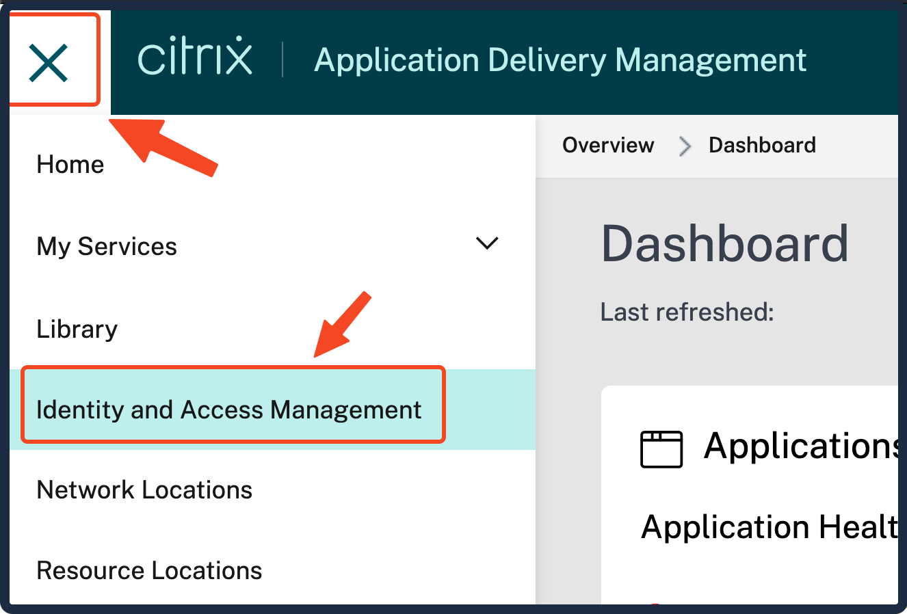
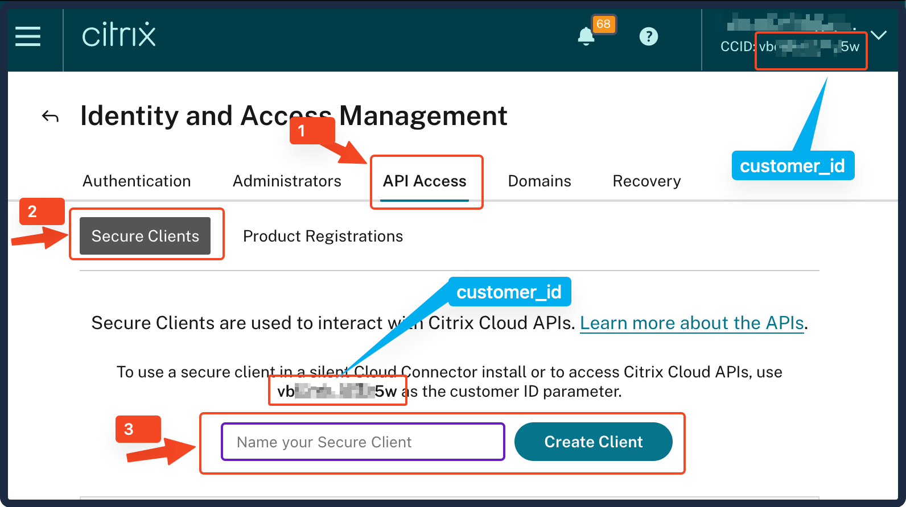
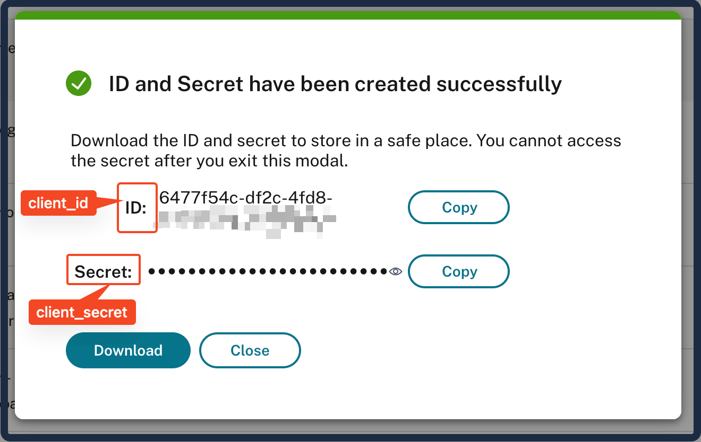

# Provider Usage

## Build the provider

Refer [README.md](./README.md)'s Build the provider section

## Authentication

### Get API Access

> You should have API access to the Citrix ADM Service. Below are the steps to get the API access.

1. 
2. 
3. 

> By the above steps, you should have got `customer_id`, `client_id` and `client_secret` for the API access.

### Configure the provider

1. Go to the respective example folder in the [examples](./examples) folder.
   Eg: Let's assume you need to crate a NS DEVICE PROFILE

   ```sh
   cd examples/resources/citrixadm_ns_device_profile
   ```

2. Configure the `provider.tf` file - There are two ways
   1. Provide `host`, `host_location`, `customer_id`, `client_id` and `client_secret` in the `provider.tf` file, OR
   2. Have the respective ENVIRNMENT variables set: `CITRIXADM_HOST`, `CITRIXADM_HOST_LOCATION`, `CITRIXADM_CUSTOMER_ID`, `CITRIXADM_CLIENT_ID` and `CITRIXADM_CLIENT_SECRET`

3. Run the `terraform init` command.
4. Run the `terraform plan` command.
5. Run the `terraform apply` command. (If you want to destroy the resource, run `terraform destroy` command).
