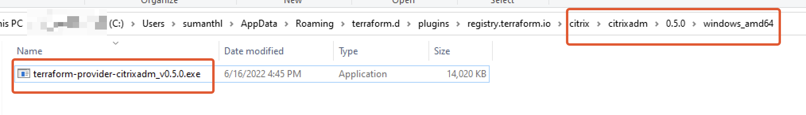
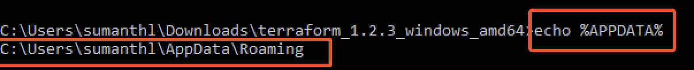
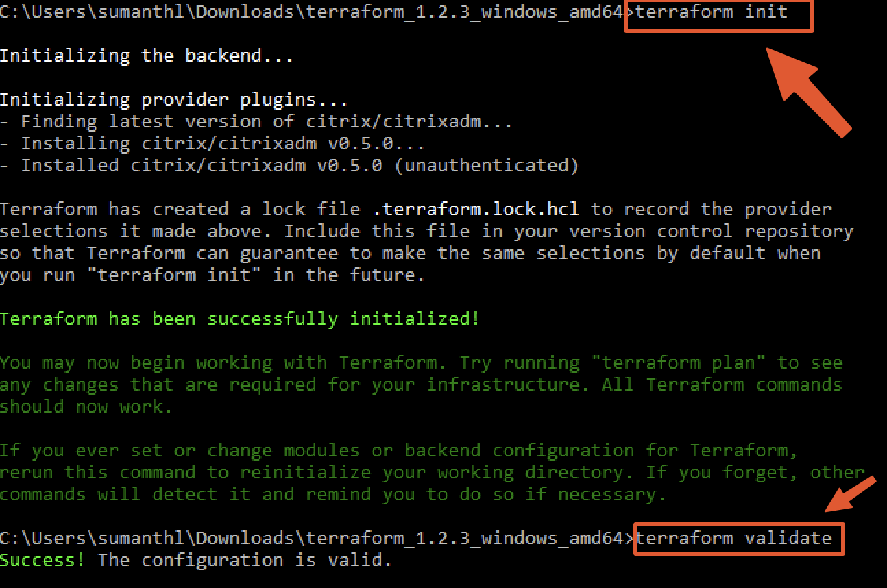

# Terraform `Citrix ADM Service` Provider

Terraform provider for [Citrix ADM Service](https://docs.citrix.com/en-us/citrix-application-delivery-management-service/citrix-application-delivery-management-service.html) provides [Infrastructure as Code (IaC)](https://en.wikipedia.org/wiki/Infrastructure_as_code) to manage your ADCs via ADM. Using the terraform provider you can onboard ADCs in ADM, assign licenses, create and trigger stylebooks, run configpacks etc.

## Requirements

* [Terraform](https://www.terraform.io/downloads.html) 1.x.x
* [Go](https://golang.org/doc/install) 1.11+ (to build the provider plugin)

## Examples

Example terrform scripts can be found in [examples](./examples/) folder

## Installing The Provider

Till the provider is available in terraform registry, you can install the provider via the following steps:

The latest released version of the provider is available on [the Release Page](https://github.com/citrix/terraform-provider-citrixadm/releases).

Download the zip file as per your operating system and architecture.

Click below against your operationg system to know how to install the provider.

  
Linux

  1. Extract the zip file and copy the binary to `~/.terraform.d/plugins/registry.terraform.io/citrix/citrixadm/<VERSION>/linux_amd64` directory. Create the directory if this is not already present.

    1. where `<VERSION>` is the version of the provider you have downloaded.  Eg: `0.5.0`

  
MacOS

  1. Extract the zip file and copy the binary to `~/.terraform.d/plugins/registry.terraform.io/citrix/citrixadm/<VERSION>/darwin_amd64` directory. Create the directory if this is not already present.

    1. where `<VERSION>` is the version of the provider you have downloaded. Eg: `0.5.0`

  
Windows

  1. Extract the zip file and copy the `.exe` file to `%APPDATA%/terraform.d/plugins/registry.terraform.io/citrix/citrixadm/<version>/<OSARCH>/` directory. Create the directory if this is not already present.

     1. Where, `<version>` is the version of the provider, Eg: `0.5.0`, `<OSARCH>` is the operating system and architecture. Eg: `windows_amd64`(usually this will be the one) or `windows_386`
     2. 
     3. You can check the location of APPDATA by running `echo %APPDATA%` in a command prompt.
     4. 

## Validate the installation

1. Copy a sample [provider.tf](./examples/provider/provider.tf) file to a new directory.
2. Open command prompt/terminal and run the following command:
3. `terraform init` and `terraform validate`
4. 

## Using the provider

Documentation can be found [here](./PROVIDER_USAGE.md).
